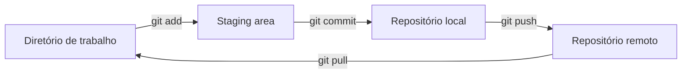
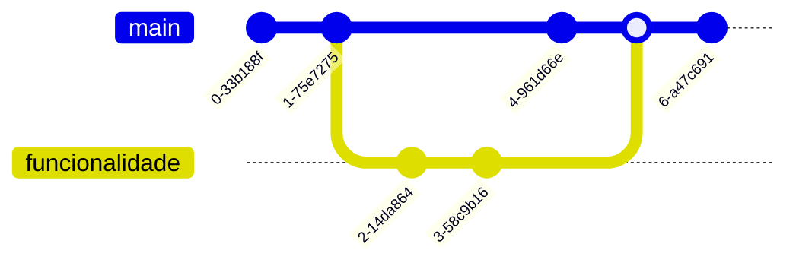

# Git e GitHub

Anotações de estudo sobre **Git** e **GitHub**, feitas a partir do curso gratuito do [Curso em Vídeo](https://www.cursoemvideo.com) com o Prof. Gustavo Guanabara. O objetivo é reunir em um só lugar os conceitos e os comandos mais usados no dia a dia.

## Sumário

- [Material das aulas](#material-das-aulas)
- [O que é controle de versão](#o-que-é-controle-de-versão)
- [Git não é GitHub](#git-não-é-github)
- [Primeiros passos](#primeiros-passos)
- [Como o Git organiza as alterações](#como-o-git-organiza-as-alterações)
- [Fluxo do dia a dia](#fluxo-do-dia-a-dia)
- [Desfazer alterações](#desfazer-alterações)
- [Repositório remoto](#repositório-remoto)
- [Branches](#branches)
- [GitHub](#github)
- [Referência rápida](#referência-rápida)
- [Créditos](#créditos)

## Material das aulas

| Aula | Tema | Slides |
|---|---|---|
| 01 | O que é Git | [PDF](slides-aulas/01-O%20que%20%C3%A9%20Git.pdf) |
| 02 | O que é GitHub | [PDF](slides-aulas/02-O%20que%20%C3%A9%20GitHub.pdf) |
| 03 | Evolução do Git e do GitHub | [PDF](slides-aulas/03-Evolu%C3%A7%C3%A3o%20Git%20e%20GitHub.pdf) |
| 11 | Segurança no GitHub | [PDF](slides-aulas/11-Seguran%C3%A7a%20GitHub.pdf) |
| 12 | Branches (ramificações) | [PDF](slides-aulas/12-Branches.pdf) |

Os slides das aulas 04 a 10 ainda não foram adicionados. O repositório também traz um [guia de Markdown](guia-markdown.pdf), útil para escrever arquivos como este README.

## O que é controle de versão

Sem uma ferramenta de versionamento, é comum acabar com uma pasta assim:

```text
site-cliente.zip
site-cliente-v2.zip
site-cliente-final.zip
site-cliente-agora-vai.zip
site-cliente-mudou-tudo.zip
```

Ninguém sabe qual é a versão certa, o que mudou de uma para outra, nem quem mudou. Quando várias pessoas trabalham no mesmo projeto trocando arquivos por e-mail ou Google Drive, fica ainda pior.

Um **sistema de controle de versão** (VCS, *Version Control System*) resolve isso. Ele registra cada alteração dos arquivos com autor, data e descrição, e permite voltar a qualquer versão anterior. As principais vantagens são:

- **Histórico:** cada mudança fica registrada e pode ser consultada ou desfeita.
- **Trabalho em equipe:** várias pessoas alteram o mesmo projeto sem sobrescrever o trabalho umas das outras.
- **Ramificação:** uma novidade pode ser desenvolvida em paralelo, sem mexer na versão principal.
- **Segurança:** com cópias do repositório em mais de um lugar, perder um computador não significa perder o projeto.
- **Organização:** a versão atual e todas as anteriores ficam em um só lugar.

### Centralizado × distribuído

| | Centralizado | Distribuído |
|---|---|---|
| Onde fica o histórico | Só no servidor central | Em cada máquina, com uma cópia completa |
| O que o commit faz | Envia direto para o servidor | Grava no repositório local; o `push` envia para o remoto depois |
| Funciona sem internet? | Não | Sim; a rede só é necessária para sincronizar |
| Exemplos | CVS, SVN (Subversion), Perforce | **Git**, Mercurial, Bazaar |

## Git não é GitHub

São duas coisas diferentes, que costumam ser usadas juntas:

- **Git** é o *software* de controle de versão. Ele roda no seu computador e cuida do repositório local: registra os commits, cria branches e junta alterações.
- **GitHub** é uma *plataforma on-line* que hospeda repositórios Git. Além de guardar o código, funciona como uma rede social para programadores, com perfil público, seguidores, estrelas em projetos, issues, pull requests e forks.

Dá para usar o Git sem o GitHub, só localmente ou com outro serviço de hospedagem, como GitLab, Bitbucket ou Gogs.

### Um pouco de história

| Ano | O que aconteceu |
|---|---|
| 1990 | Lançamento do **CVS**, sistema centralizado e *open source* que se tornou o mais popular da época. |
| 2000 | Surge o **SVN** (Subversion), também centralizado, criado para corrigir problemas do CVS. Ainda é usado hoje. |
| 2002 | O projeto do kernel **Linux** passa a usar o **BitKeeper**, um sistema distribuído e proprietário que tinha uma versão gratuita para a comunidade. |
| 2005 | A empresa dona do BitKeeper retira a versão gratuita depois que um desenvolvedor faz engenharia reversa do protocolo. Em resposta, **Linus Torvalds** cria o **Git**: distribuído, *open source* e focado em desempenho. A primeira versão fica pronta em cerca de 10 dias. |
| 2008 | Lançamento do **GitHub**, serviço de hospedagem de código baseado em Git. |
| 2018 | A **Microsoft** compra o GitHub por US$ 7,5 bilhões. O GitHub continua operando de forma independente. |
| 2020 | O GitHub compra o **npm**, gerenciador de pacotes do JavaScript. |

E o nome? Em gíria britânica, *git* é uma pessoa teimosa e desagradável, e Linus brincou que batiza todos os projetos com o próprio nome. O README do Git sugere outras leituras, como *global information tracker*.

## Primeiros passos

### Instalar e configurar

Baixe o Git em [git-scm.com](https://git-scm.com/downloads) e confira a instalação:

```bash
git --version
```

Antes do primeiro commit, informe ao Git quem você é. Esses dados ficam gravados em cada commit, então use o mesmo e-mail da sua conta no GitHub para que os commits apareçam no seu perfil:

```bash
git config --global user.name "Seu Nome"
git config --global user.email "seu-email@exemplo.com"
git config --global init.defaultBranch main   # nome da branch principal em repositórios novos
```

A opção `--global` vale para todos os repositórios do seu usuário. Para ver as configurações atuais, use `git config --list`.

### Criar ou clonar um repositório

Um **repositório** é a pasta do projeto mais o histórico de versões, que o Git guarda na subpasta oculta `.git`. Há duas formas de começar:

- **Criar um repositório do zero** numa pasta que já existe:

  ```bash
  cd meu-projeto
  git init
  ```

- **Clonar um repositório remoto**, por exemplo do GitHub. É o caso mais comum: o Git baixa o projeto com todo o histórico e já deixa configurada a ligação com o remoto.

  ```bash
  git clone https://github.com/marcospontoexe/Git-e-GitHub.git
  git clone https://github.com/marcospontoexe/Git-e-GitHub.git estudos-git   # clona na pasta "estudos-git"
  ```

  Sem o último parâmetro, a pasta recebe o nome do repositório (`Git-e-GitHub`).

## Como o Git organiza as alterações

### As três áreas

Uma alteração passa por três lugares na sua máquina antes de chegar ao remoto:

1. **Diretório de trabalho** (*working directory*): os arquivos que você vê e edita na pasta do projeto.
2. **Staging area** (ou *index*): onde você separa quais alterações vão entrar no próximo commit.
3. **Repositório local** (pasta `.git`): o histórico de commits.

O **repositório remoto** (no GitHub, por exemplo) é uma cópia do repositório num servidor, usada para compartilhar o trabalho e como backup.



A staging area serve para montar commits organizados. Se você editou cinco arquivos mas só três fazem parte da mesma correção, adicione esses três e faça o commit; os outros ficam para o próximo.

### Estados de um arquivo

| Estado | Significado | Como chega nele |
|---|---|---|
| **Não rastreado** (*untracked*) | Arquivo novo, que o Git ainda não controla | Criar o arquivo |
| **Modificado** (*modified*) | Arquivo rastreado que mudou desde o último commit | Editar o arquivo |
| **Preparado** (*staged*) | Alteração marcada para entrar no próximo commit | `git add` |
| **Sem alterações** (*unmodified*) | Igual à última versão gravada no repositório | `git commit` |

O comando `git status` mostra o estado de cada arquivo. Editores como o VS Code mostram a mesma informação com letras ao lado do nome: **U** (não rastreado), **M** (modificado) e **A** (adicionado ao staging).

## Fluxo do dia a dia

O ciclo básico é editar, adicionar ao staging, fazer o commit e enviar ao remoto:

```bash
git status                                  # o que mudou?
git add index.html                          # prepara um arquivo específico
git add .                                   # ou prepara tudo o que mudou na pasta atual e subpastas
git commit -m "Adiciona formulário de contato"
git push                                    # envia os commits para o remoto
```

Você pode fazer vários commits antes de um `push`. Eles ficam guardados no repositório local, e o `push` envia todos de uma vez.

### Ver o que mudou

| Comando | Mostra |
|---|---|
| `git status` | arquivos modificados, preparados e não rastreados |
| `git diff` | linhas alteradas que ainda **não** estão no staging |
| `git diff --staged` | linhas que **já** estão no staging e vão entrar no próximo commit |
| `git log` | histórico de commits, com autor, data e mensagem |
| `git log --oneline --graph --all` | histórico resumido, uma linha por commit, com o desenho das branches |

### Mensagens de commit

A mensagem é o que você e sua equipe vão ler no histórico daqui a meses. Algumas regras práticas:

- Escreva uma linha curta (até uns 50 caracteres) que diga **o que** o commit faz: `Corrige cálculo do frete`, e não `ajustes` ou `update`.
- Se precisar explicar o **porquê**, pule uma linha e escreva um parágrafo. Rodar `git commit` sem `-m` abre o editor para isso.
- Faça um commit por mudança lógica. Commits pequenos são mais fáceis de entender e de desfazer.

### Remover e renomear arquivos

- `git rm arquivo` apaga o arquivo do disco e já prepara a remoção para o próximo commit.
- `git rm --cached arquivo` tira o arquivo do controle do Git, mas **mantém** o arquivo no disco. É útil quando você esqueceu de colocar algo no `.gitignore` e já fez commit dele.
- `git mv antigo novo` renomeia ou move o arquivo e prepara a mudança.

Os três precisam de um `git commit` depois, como qualquer outra alteração.

### Ignorar arquivos com .gitignore

Alguns arquivos não devem ir para o repositório:

- configurações locais, que mudam de pessoa para pessoa (por exemplo, os dados de conexão com o banco de dados de cada desenvolvedor);
- arquivos da IDE ou do editor (`.vscode/`, `.idea/`);
- arquivos gerados na compilação, que qualquer pessoa consegue gerar de novo a partir do código (`.class` no Java, `node_modules/` no JavaScript, `build/`);
- senhas, tokens e chaves de API.

Para ignorá-los, crie um arquivo chamado `.gitignore` na raiz do projeto, com um padrão por linha:

```gitignore
# arquivos gerados
*.class
build/
node_modules/

# editor e sistema operacional
.vscode/
.idea/
.DS_Store
Thumbs.db

# configurações locais e segredos
config.local.xml
.env
```

Os arquivos que correspondem a esses padrões somem do `git status` e não entram no `git add .`. O `.gitignore` não afeta arquivos que já são rastreados; para esses, rode `git rm --cached arquivo` e faça um commit.

> **Atenção:** se uma senha ou chave já entrou em um commit, ela continua no histórico mesmo depois de apagada do arquivo. Troque a senha ou gere uma chave nova.

Há modelos prontos de `.gitignore` para cada linguagem no repositório [github/gitignore](https://github.com/github/gitignore).

## Desfazer alterações

O comando certo depende de onde a alteração está:

| Situação | Comando | O que acontece |
|---|---|---|
| Editei um arquivo e quero voltar à versão do último commit | `git restore arquivo` | Descarta as alterações do arquivo. **Não tem volta.** |
| Adicionei um arquivo ao staging por engano | `git restore --staged arquivo` | Tira o arquivo do staging; as alterações continuam nele |
| Errei a mensagem do último commit ou esqueci um arquivo (ainda sem `push`) | `git add arquivo` e depois `git commit --amend` | Substitui o último commit por uma versão corrigida |
| Quero desfazer o último commit mas manter as alterações (ainda sem `push`) | `git reset --soft HEAD~1` | Apaga o commit; as alterações voltam para o staging |
| O commit já foi enviado ao remoto | `git revert <hash>` | Cria um **novo** commit que desfaz o commit indicado |

O `<hash>` é o código que identifica o commit, visto com `git log --oneline` (por exemplo, `9222f5e`).

Para commits que já foram enviados, use `revert`. O `--amend` e o `reset` reescrevem o histórico: se outras pessoas já baixaram aqueles commits, o histórico delas deixa de bater com o seu e o próximo `push` é recusado. O `revert` só acrescenta um commit novo, por isso é seguro.

## Repositório remoto

Quando você clona um repositório, o remoto já vem configurado com o nome **origin**. Se o projeto começou com `git init`, crie um repositório vazio no GitHub e ligue os dois:

```bash
git remote add origin https://github.com/seu-usuario/seu-repositorio.git
git push -u origin main   # primeiro envio; o -u faz o Git lembrar o destino
```

A partir daí, basta usar `git push` e `git pull`.

| Comando | O que faz |
|---|---|
| `git remote -v` | lista os remotos configurados |
| `git push` | envia os seus commits locais para o remoto |
| `git fetch` | baixa as novidades do remoto sem mexer nos seus arquivos |
| `git pull` | baixa as novidades e já as junta à sua branch (`fetch` + `merge`) |

Se alguém enviou commits que você ainda não tem, o `git push` é recusado. Rode `git pull`, resolva os conflitos, se houver, e tente o `push` de novo. Um bom hábito é dar `git pull` antes de começar a trabalhar.

## Branches

Uma **branch** (ramificação) é uma linha de desenvolvimento independente. A branch principal se chama `main` (em repositórios mais antigos, `master`).

Fazer todos os commits direto na `main` é arriscado: um trabalho pela metade ou com erro fica misturado com o código que funciona. O ideal é criar uma branch para cada funcionalidade ou correção, trabalhar nela e, quando estiver pronta, fazer o **merge** (juntar) de volta na `main`. Se a ideia não der certo, basta apagar a branch, e a `main` continua intacta.



```bash
git branch                          # lista as branches (a atual aparece com *)
git switch -c nova-funcionalidade   # cria a branch e muda para ela
# ... edite, git add, git commit ...
git switch main                     # volta para a main
git merge nova-funcionalidade       # traz os commits da branch para a main
git branch -d nova-funcionalidade   # apaga a branch, que já foi mesclada
```

Para enviar a branch ao GitHub, use `git push -u origin nova-funcionalidade`. Em versões antigas do Git, que não têm `git switch`, use `git checkout -b nome` para criar a branch e `git checkout nome` para mudar de branch.

### Conflitos de merge

Se as duas branches alteraram as mesmas linhas de um arquivo, o Git não sabe qual versão manter e interrompe o merge com um **conflito**. O arquivo fica marcado assim:

```text
<<<<<<< HEAD
texto como está na branch atual
=======
texto como está na branch que está sendo mesclada
>>>>>>> nova-funcionalidade
```

Para resolver:

1. Edite o arquivo, deixe o conteúdo final que você quer e apague as linhas `<<<<<<<`, `=======` e `>>>>>>>`.
2. Rode `git add arquivo` para marcar o conflito como resolvido.
3. Rode `git commit` para concluir o merge.

Para desistir do merge e voltar ao estado anterior, use `git merge --abort`.

## GitHub

Além de guardar repositórios, o GitHub oferece:

- **Repositórios ilimitados**, públicos e privados, no plano gratuito.
- **Perfil e rede social:** seguir pessoas, dar estrelas em projetos e mostrar sua atividade de contribuições.
- **Colaboração:** *issues* para registrar bugs e tarefas, e *pull requests* para revisar código antes do merge.
- **Forks:** cópias de repositórios de outras pessoas na sua conta.
- **GitHub Pages:** publicação de sites estáticos direto de um repositório.

Para criar uma conta, acesse [github.com](https://github.com).

### Fork, clone e pull request

- **Clone** copia um repositório remoto para a sua máquina.
- **Fork** copia o repositório de outra pessoa para a **sua conta** no GitHub. Serve para trabalhar em projetos nos quais você não tem permissão de escrita.
- **Pull request** (PR) é um pedido para juntar as alterações de uma branch (ou de um fork) em outra branch. Os responsáveis pelo projeto revisam, comentam e decidem se fazem o merge.

Para contribuir com o projeto de outra pessoa, o fluxo típico é: fork → clone do seu fork → nova branch → commits → push → abrir o pull request no GitHub.

### Segurança da conta

**Use uma senha forte:**

- Longa: o GitHub exige pelo menos 15 caracteres, ou 8 caracteres com pelo menos um número e uma letra minúscula.
- Misture letras maiúsculas e minúsculas, números e símbolos.
- Evite nomes, palavras comuns e padrões como `123456` ou `qwerty`.
- Não reaproveite senhas de outros sites e nunca compartilhe a sua. Um gerenciador de senhas ajuda.

**Ative a autenticação em dois fatores (2FA).** Com ela, o login pede, além da senha, um código que muda a cada 30 segundos e é gerado no seu celular. Mesmo que alguém descubra sua senha, não consegue entrar sem o celular. O GitHub exige 2FA de quem contribui com código na plataforma. Para ativar:

1. Clique na sua foto de perfil e acesse **Settings → Password and authentication**.
2. Clique em **Enable two-factor authentication**.
3. Escaneie o QR code com um app autenticador (Google Authenticator, Microsoft Authenticator, Authy, 1Password etc.).
4. Digite o código de 6 dígitos que aparece no app.
5. **Guarde os códigos de recuperação** (*recovery codes*) em lugar seguro. Se você perder o celular, eles são a única forma de entrar, porque o suporte do GitHub não recupera contas com 2FA.

Também é possível usar chaves de segurança físicas ou *passkeys* como segundo fator.

**Autenticação no terminal:** desde 2021, o GitHub não aceita a senha da conta no `git push` por HTTPS. No Windows, o Git Credential Manager, instalado junto com o Git, abre o navegador para você fazer login uma vez. As alternativas são um *personal access token* ou uma chave SSH.

## Referência rápida

| Comando | Para que serve |
|---|---|
| `git config --global user.name "Nome"` | define o seu nome nos commits |
| `git init` | cria um repositório na pasta atual |
| `git clone <url>` | copia um repositório remoto |
| `git status` | mostra o estado dos arquivos |
| `git add <arquivo>` / `git add .` | prepara alterações para o commit |
| `git commit -m "mensagem"` | grava as alterações preparadas |
| `git log --oneline` | mostra o histórico resumido |
| `git diff` | mostra as alterações ainda não preparadas |
| `git restore <arquivo>` | descarta as alterações de um arquivo |
| `git restore --staged <arquivo>` | tira um arquivo do staging |
| `git rm --cached <arquivo>` | para de rastrear um arquivo sem apagá-lo do disco |
| `git revert <hash>` | desfaz um commit criando outro |
| `git branch` | lista as branches |
| `git switch -c <nome>` | cria uma branch e muda para ela |
| `git switch <nome>` | muda de branch |
| `git merge <nome>` | junta outra branch à branch atual |
| `git remote add origin <url>` | liga o repositório local a um remoto |
| `git push` | envia os commits para o remoto |
| `git pull` | baixa as novidades do remoto e junta à branch atual |

## Créditos

Os slides em [slides-aulas/](slides-aulas/) são do **Prof. Gustavo Guanabara** ([Curso em Vídeo](https://www.cursoemvideo.com)), publicados em [github.com/gustavoguanabara](https://github.com/gustavoguanabara). Pelos termos do autor, o material pode ser usado livremente para aprendizado, desde que seja mantida a referência ao original.
