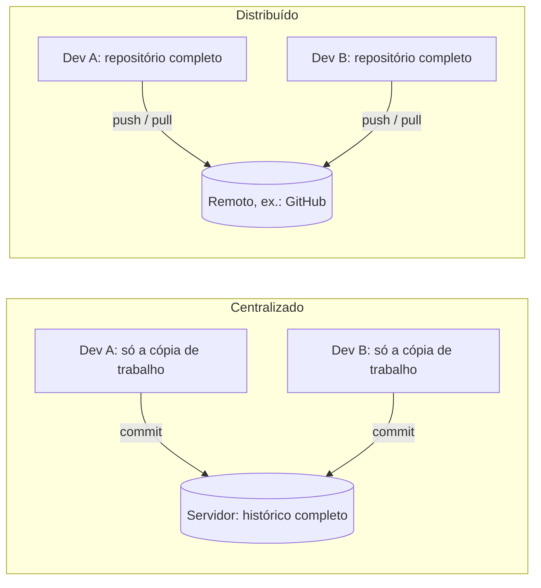
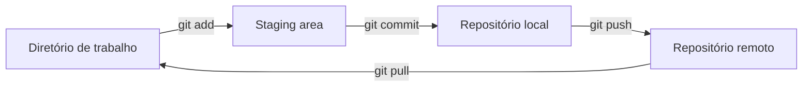
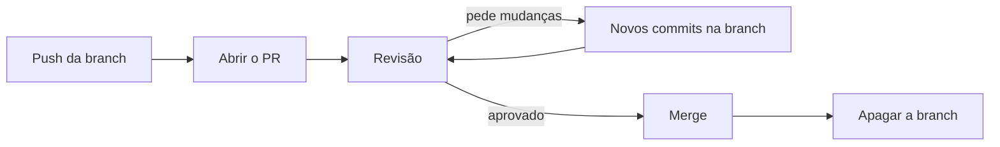

# Git e GitHub

Anotações de estudo sobre **Git** e **GitHub**, feitas a partir do curso gratuito do [Curso em Vídeo](https://www.cursoemvideo.com) com o Prof. Gustavo Guanabara. O objetivo é reunir em um só lugar os conceitos e os comandos mais usados no dia a dia.

## Sumário

- [Material das aulas](#material-das-aulas)
- [O que é controle de versão](#o-que-é-controle-de-versão)
- [Git não é GitHub](#git-não-é-github)
- [Primeiros passos](#primeiros-passos)
- [Como o Git organiza as alterações](#como-o-git-organiza-as-alterações)
- [Fluxo do dia a dia](#fluxo-do-dia-a-dia)
- [Desfazer alterações](#desfazer-alterações)
- [Repositório remoto](#repositório-remoto)
- [Branches](#branches)
- [GitHub](#github)
- [Referência rápida](#referência-rápida)
- [Créditos](#créditos)

## Material das aulas

| Aula | Tema | Slides |
|---|---|---|
| 01 | O que é Git | [PDF](slides-aulas/01-O%20que%20%C3%A9%20Git.pdf) |
| 02 | O que é GitHub | [PDF](slides-aulas/02-O%20que%20%C3%A9%20GitHub.pdf) |
| 03 | Evolução do Git e do GitHub | [PDF](slides-aulas/03-Evolu%C3%A7%C3%A3o%20Git%20e%20GitHub.pdf) |
| 11 | Segurança no GitHub | [PDF](slides-aulas/11-Seguran%C3%A7a%20GitHub.pdf) |
| 12 | Branches (ramificações) | [PDF](slides-aulas/12-Branches.pdf) |

Os slides das aulas 04 a 10 ainda não foram adicionados. O repositório também traz um [guia de Markdown](guia-markdown.pdf), útil para escrever arquivos como este README.

## O que é controle de versão

Sem uma ferramenta de versionamento, é comum acabar com uma pasta assim:

```text
site-cliente.zip
site-cliente-v2.zip
site-cliente-final.zip
site-cliente-agora-vai.zip
site-cliente-mudou-tudo.zip
```

Ninguém sabe qual é a versão certa, o que mudou de uma para outra, nem quem mudou. Quando várias pessoas trabalham no mesmo projeto trocando arquivos por e-mail ou Google Drive, fica ainda pior.

Um **sistema de controle de versão** (VCS, *Version Control System*) resolve isso. Ele registra cada alteração dos arquivos com autor, data e descrição, e permite voltar a qualquer versão anterior. As principais vantagens são:

- **Histórico:** cada mudança fica registrada e pode ser consultada ou desfeita.
- **Trabalho em equipe:** várias pessoas alteram o mesmo projeto sem sobrescrever o trabalho umas das outras.
- **Ramificação:** uma novidade pode ser desenvolvida em paralelo, sem mexer na versão principal.
- **Segurança:** com cópias do repositório em mais de um lugar, perder um computador não significa perder o projeto.
- **Organização:** a versão atual e todas as anteriores ficam em um só lugar.

### Centralizado × distribuído

A diferença está em **onde o histórico fica guardado**.

No modelo **centralizado** (CVS, SVN, Perforce), o histórico existe em um único lugar: o servidor. Cada pessoa tem na máquina só uma cópia de trabalho, ou seja, os arquivos de uma versão, sem o histórico. Para fazer um commit, ver versões antigas ou comparar alterações, é preciso falar com o servidor. É como um livro de registros que fica só no cartório: para consultar ou registrar qualquer coisa, você precisa ir até lá.

No modelo **distribuído** (Git, Mercurial, Bazaar), cada máquina tem um repositório completo, com todo o histórico. Commit, histórico, comparação de versões e criação de branches acontecem no seu computador, sem rede. Só o `push` e o `pull` falam com o remoto, para trocar commits. É como se cada pessoa tivesse uma cópia inteira do livro de registros e, de tempos em tempos, as cópias fossem sincronizadas.



Na prática, a diferença aparece nestas situações:

| Situação | Centralizado (ex.: SVN) | Distribuído (ex.: Git) |
|---|---|---|
| Ver o histórico ou comparar versões | Consulta o servidor | Consulta local e instantânea |
| Fazer um commit | Vai direto para o servidor e fica disponível para todos na hora | Fica na sua máquina até o `push` |
| Sem internet ou com o servidor fora do ar | Não dá para fazer commit nem ver o histórico | Trabalha normalmente e sincroniza depois |
| O servidor perde os dados | Histórico perdido, se não houver backup | Qualquer clone tem o histórico inteiro e restaura tudo |
| Testar uma ideia numa branch | A branch é criada no servidor, à vista de todos | A branch é local e privada até você enviá-la |
| O que se baixa no início | Só a versão atual dos arquivos | O histórico inteiro, que pode pesar em projetos muito grandes |

No Git, o GitHub só é o "servidor central" por combinação da equipe, não por exigência técnica: todos os clones são equivalentes, e um repositório pode ter vários remotos ou nenhum. O preço dessa liberdade é aprender dois passos onde o modelo centralizado tem um só: o commit, que grava na sua máquina, e o push, que envia para o remoto.

## Git não é GitHub

São duas coisas diferentes, que costumam ser usadas juntas:

- **Git** é o *software* de controle de versão. Ele roda no seu computador e cuida do repositório local: registra os commits, cria branches e junta alterações.
- **GitHub** é uma *plataforma on-line* que hospeda repositórios Git. Além de guardar o código, funciona como uma rede social para programadores, com perfil público, seguidores, estrelas em projetos, issues, pull requests e forks.

Dá para usar o Git sem o GitHub, só localmente ou com outro serviço de hospedagem, como GitLab, Bitbucket ou Gogs.

### Um pouco de história

| Ano | O que aconteceu |
|---|---|
| 1990 | Lançamento do **CVS**, sistema centralizado e *open source* que se tornou o mais popular da época. |
| 2000 | Surge o **SVN** (Subversion), também centralizado, criado para corrigir problemas do CVS. Ainda é usado hoje. |
| 2002 | O projeto do kernel **Linux** passa a usar o **BitKeeper**, um sistema distribuído e proprietário que tinha uma versão gratuita para a comunidade. |
| 2005 | A empresa dona do BitKeeper retira a versão gratuita depois que um desenvolvedor faz engenharia reversa do protocolo. Em resposta, **Linus Torvalds** cria o **Git**: distribuído, *open source* e focado em desempenho. A primeira versão fica pronta em cerca de 10 dias. |
| 2008 | Lançamento do **GitHub**, serviço de hospedagem de código baseado em Git. |
| 2018 | A **Microsoft** compra o GitHub por US$ 7,5 bilhões. O GitHub continua operando de forma independente. |
| 2020 | O GitHub compra o **npm**, gerenciador de pacotes do JavaScript. |

E o nome? Em gíria britânica, *git* é uma pessoa teimosa e desagradável, e Linus brincou que batiza todos os projetos com o próprio nome. O README do Git sugere outras leituras, como *global information tracker*.

## Primeiros passos

### Instalar e configurar

Baixe o Git em [git-scm.com](https://git-scm.com/downloads) e confira a instalação:

```bash
git --version
```

Antes do primeiro commit, informe ao Git quem você é. Esses dados ficam gravados em cada commit, então use o mesmo e-mail da sua conta no GitHub para que os commits apareçam no seu perfil:

```bash
git config --global user.name "Seu Nome"
git config --global user.email "seu-email@exemplo.com"
git config --global init.defaultBranch main   # nome da branch principal em repositórios novos
```

A opção `--global` vale para todos os repositórios do seu usuário. Para ver as configurações atuais, use `git config --list`.

### Criar ou clonar um repositório

Um **repositório** é a pasta do projeto mais o histórico de versões, que o Git guarda na subpasta oculta `.git`. Há duas formas de começar:

- **Criar um repositório do zero** numa pasta que já existe:

  ```bash
  cd meu-projeto
  git init
  ```

- **Clonar um repositório remoto**, por exemplo do GitHub. É o caso mais comum: o Git baixa o projeto com todo o histórico e já deixa configurada a ligação com o remoto.

  ```bash
  git clone https://github.com/marcospontoexe/Git-e-GitHub.git
  git clone https://github.com/marcospontoexe/Git-e-GitHub.git estudos-git   # clona na pasta "estudos-git"
  ```

  Sem o último parâmetro, a pasta recebe o nome do repositório (`Git-e-GitHub`).

## Como o Git organiza as alterações

### As três áreas

Uma alteração passa por três lugares na sua máquina antes de chegar ao remoto:

1. **Diretório de trabalho** (*working directory*): os arquivos que você vê e edita na pasta do projeto.
2. **Staging area** (ou *index*): onde você separa quais alterações vão entrar no próximo commit.
3. **Repositório local** (pasta `.git`): o histórico de commits.

O **repositório remoto** (no GitHub, por exemplo) é uma cópia do repositório num servidor, usada para compartilhar o trabalho e como backup.



A staging area serve para montar commits organizados. Se você editou cinco arquivos mas só três fazem parte da mesma correção, adicione esses três e faça o commit; os outros ficam para o próximo.

### Estados de um arquivo

| Estado | Significado | Como chega nele |
|---|---|---|
| **Não rastreado** (*untracked*) | Arquivo novo, que o Git ainda não controla | Criar o arquivo |
| **Modificado** (*modified*) | Arquivo rastreado que mudou desde o último commit | Editar o arquivo |
| **Preparado** (*staged*) | Alteração marcada para entrar no próximo commit | `git add` |
| **Sem alterações** (*unmodified*) | Igual à última versão gravada no repositório | `git commit` |

O comando `git status` mostra o estado de cada arquivo. Editores como o VS Code mostram a mesma informação com letras ao lado do nome: **U** (não rastreado), **M** (modificado) e **A** (adicionado ao staging).

### O que tem dentro da pasta .git

A pasta `.git` **é** o repositório. O resto da pasta do projeto é só a cópia de trabalho, com os arquivos da versão em que você está. Isso tem duas consequências práticas:

- Apagar a `.git` apaga todo o histórico. A pasta vira uma pasta comum, só com os arquivos da versão atual.
- Copiar a pasta do projeto inteira, com a `.git`, copia o repositório completo.

A pasta fica oculta porque não é para mexer nela à mão: para tudo existe um comando do Git. Os itens principais são:

| Item | O que guarda |
|---|---|
| `objects/` | O banco de dados com todo o conteúdo do repositório: cada versão de cada arquivo, cada pasta e cada commit, comprimidos e identificados por um hash |
| `refs/` | As branches (`refs/heads/`), as branches do remoto (`refs/remotes/`) e as tags (`refs/tags/`). Cada uma é só um arquivo de texto com o hash do commit para onde aponta |
| `HEAD` | Em qual branch você está. Neste repositório, o conteúdo é `ref: refs/heads/main` |
| `index` | A staging area, com o que vai entrar no próximo commit |
| `config` | As configurações deste repositório, como o endereço do `origin`. É onde o `git config` grava quando usado sem `--global` |
| `logs/` | O *reflog*: o registro de para onde o `HEAD` e cada branch apontaram ao longo do tempo |
| `hooks/` | Scripts que rodam automaticamente em certos momentos, como antes de cada commit. Os exemplos vêm com a extensão `.sample` e ficam desativados |
| `info/exclude` | Padrões de arquivos ignorados só na sua máquina. Funciona como um `.gitignore` que não é compartilhado |

Outros arquivos aparecem com o uso, como `COMMIT_EDITMSG` (a mensagem do último commit), `FETCH_HEAD` (o resultado do último `git fetch`) e `packed-refs` (várias refs reunidas num arquivo só).

#### Como o Git guarda o histórico

Dentro de `objects/` há três tipos principais de objeto. Cada um é identificado por um **hash** (SHA-1), um código de 40 caracteres calculado a partir do conteúdo:

- **blob:** o conteúdo de um arquivo;
- **tree:** uma pasta, ou seja, a lista de arquivos (blobs) e subpastas (trees), com os nomes;
- **commit:** aponta para a tree da raiz do projeto naquele momento e para o commit anterior (*parent*), e guarda autor, data e mensagem.

O comando `git cat-file -p` mostra qualquer objeto. Este é o commit `3e7d0fe` deste repositório:

```text
$ git cat-file -p 3e7d0fe
tree 7cc7c00cadd882ab2b0265bac36d1ebaffbc8514
parent 9222f5e08e7e0c2994141775f52f85fd4df57e06
author marcos daniel santana <...> 1790560652 -0300
committer marcos daniel santana <...> 1790560652 -0300

docs: README updated.
```

E esta é a tree para onde ele aponta, a raiz do projeto naquele commit:

```text
$ git cat-file -p 7cc7c00
100644 blob dfe0770424b2a19faf507a501ebfc23be8f54e7b    .gitattributes
100644 blob 10771db8291c2b33adb45db6ad150e24240ac808    CLAUDE.md
100644 blob 0ef2abd733a93728d11f340405a12675c11bd511    README.md
...
040000 tree 133f54f67f090fd65f4b616b7cb2b926bbe0eec6    slides-aulas
```

Daí saem três ideias importantes:

- **Cada commit é uma foto completa do projeto**, não uma lista de diferenças. Arquivos que não mudaram não são copiados de novo: a tree nova aponta para o mesmo blob da versão anterior. Para economizar espaço, o Git ainda compacta os objetos em *packfiles*, mas isso é invisível para quem usa.
- **O hash depende do conteúdo.** Se um único byte muda, o hash muda. Por isso o Git detecta qualquer alteração ou arquivo corrompido, e um commit antigo não pode ser modificado sem mudar o hash dele e de todos os commits seguintes.
- **Uma branch é só um ponteiro** para um commit: um arquivo em `refs/heads/` com um hash dentro. Criar uma branch custa quase nada, e é por isso que o Git incentiva usar muitas.

**O reflog salva vidas.** Se você apagou uma branch ou desfez um commit com `reset` e se arrependeu, `git reflog` lista por onde o `HEAD` passou, com os hashes. Com o hash em mãos, `git switch -c resgate <hash>` cria uma branch nesse ponto e recupera o trabalho. Commits sem nenhuma branch apontando para eles ficam guardados por cerca de um mês, por padrão, antes de serem apagados de vez.

## Fluxo do dia a dia

O ciclo básico é editar, adicionar ao staging, fazer o commit e enviar ao remoto:

```bash
git status                                  # o que mudou?
git add index.html                          # prepara um arquivo específico
git add .                                   # ou prepara tudo o que mudou na pasta atual e subpastas
git commit -m "feat: adiciona formulário de contato"
git push                                    # envia os commits para o remoto
```

Você pode fazer vários commits antes de um `push`. Eles ficam guardados no repositório local, e o `push` envia todos de uma vez.

### Ver o que mudou

| Comando | Mostra |
|---|---|
| `git status` | arquivos modificados, preparados e não rastreados |
| `git diff` | linhas alteradas que ainda **não** estão no staging |
| `git diff --staged` | linhas que **já** estão no staging e vão entrar no próximo commit |
| `git log` | histórico de commits, com autor, data e mensagem |
| `git log --oneline --graph --all` | histórico resumido, uma linha por commit, com o desenho das branches |

### Mensagens de commit

A mensagem é o que você e sua equipe vão ler no histórico daqui a meses. Ela precisa dizer o que mudou sem que seja preciso abrir o código. A estrutura recomendada é:

```text
tipo(escopo): resumo curto do que o commit faz

Corpo opcional explicando o porquê da mudança, o problema que ela
resolve ou algo que não fica óbvio lendo o código. Quebre as linhas
em torno de 72 caracteres.

Closes #42
```

- **Resumo:** até uns 50 caracteres (no máximo 72), sem ponto final. Comece com um verbo que diga o que o commit faz: `adiciona`, `corrige`, `remove`, `atualiza`.
- **Linha em branco** entre o resumo e o corpo. O Git e o GitHub usam a primeira linha como título do commit.
- **Corpo** (opcional): explique o **porquê**, porque o **o quê** já aparece no diff. Rodar `git commit` sem `-m` abre o editor para escrever várias linhas. Outra opção é repetir o `-m`: `git commit -m "resumo" -m "corpo"`.
- **Rodapé** (opcional): `Closes #42` ou `Fixes #42` fecha automaticamente a issue 42 do GitHub quando o commit chega à branch principal.

**Conventional Commits.** Uma convenção muito usada é começar o resumo pelo tipo da mudança. O histórico fica fácil de ler e de filtrar, e existem ferramentas que usam esses tipos para gerar changelogs e números de versão automaticamente ([especificação em português](https://www.conventionalcommits.org/pt-br/v1.0.0/)).

| Tipo | Quando usar | Exemplo |
|---|---|---|
| `feat` | nova funcionalidade | `feat: adiciona filtro por data` |
| `fix` | correção de bug | `fix: corrige cálculo do frete` |
| `docs` | só documentação | `docs: explica o uso de branches no README` |
| `style` | formatação, sem mudar o comportamento | `style: padroniza a indentação do CSS` |
| `refactor` | reorganiza o código sem mudar o comportamento | `refactor: extrai a validação para uma função` |
| `test` | adiciona ou corrige testes | `test: cobre o cálculo do frete` |
| `chore` | manutenção, configuração, dependências | `chore: atualiza dependências` |

O escopo entre parênteses é opcional e indica a parte do projeto afetada, como em `fix(login): corrige redirecionamento após o login`. Um `!` depois do tipo (`feat!: ...`) avisa que a mudança quebra a compatibilidade com versões anteriores.

| Evite | Prefira |
|---|---|
| `update` | `docs: adiciona seção sobre a pasta .git` |
| `ajustes` | `fix: corrige link quebrado para os slides` |
| `Corrigido o bug.` | `fix: corrige erro ao salvar formulário vazio` |
| `mudanças no css, correção do login e botão novo` | três commits separados, um para cada mudança |

Mais duas regras:

- **Um commit por mudança lógica.** Se a mensagem precisa de "e" para descrever tudo, provavelmente são dois commits. Commits pequenos são mais fáceis de entender, revisar e desfazer.
- **Escolha um idioma e um tempo verbal e mantenha em todo o projeto.** Em português, o mais comum é o presente (`adiciona`, `corrige`). Em inglês, o imperativo (`add`, `fix`).

### Remover e renomear arquivos

- `git rm arquivo` apaga o arquivo do disco e já prepara a remoção para o próximo commit.
- `git rm --cached arquivo` tira o arquivo do controle do Git, mas **mantém** o arquivo no disco. É útil quando você esqueceu de colocar algo no `.gitignore` e já fez commit dele.
- `git mv antigo novo` renomeia ou move o arquivo e prepara a mudança.

Os três precisam de um `git commit` depois, como qualquer outra alteração.

### Ignorar arquivos com .gitignore

Alguns arquivos não devem ir para o repositório:

- configurações locais, que mudam de pessoa para pessoa (por exemplo, os dados de conexão com o banco de dados de cada desenvolvedor);
- arquivos da IDE ou do editor (`.vscode/`, `.idea/`);
- arquivos gerados na compilação, que qualquer pessoa consegue gerar de novo a partir do código (`.class` no Java, `node_modules/` no JavaScript, `build/`);
- senhas, tokens e chaves de API.

Para ignorá-los, crie um arquivo chamado `.gitignore` na raiz do projeto, com um padrão por linha:

```gitignore
# arquivos gerados
*.class
build/
node_modules/

# editor e sistema operacional
.vscode/
.idea/
.DS_Store
Thumbs.db

# configurações locais e segredos
config.local.xml
.env
```

Os arquivos que correspondem a esses padrões somem do `git status` e não entram no `git add .`. O `.gitignore` não afeta arquivos que já são rastreados; para esses, rode `git rm --cached arquivo` e faça um commit.

> **Atenção:** se uma senha ou chave já entrou em um commit, ela continua no histórico mesmo depois de apagada do arquivo. Troque a senha ou gere uma chave nova.

Há modelos prontos de `.gitignore` para cada linguagem no repositório [github/gitignore](https://github.com/github/gitignore).

## Desfazer alterações

O comando certo depende de onde a alteração está:

| Situação | Comando | O que acontece |
|---|---|---|
| Editei um arquivo e quero voltar à versão do último commit | `git restore arquivo` | Descarta as alterações do arquivo. **Não tem volta.** |
| Adicionei um arquivo ao staging por engano | `git restore --staged arquivo` | Tira o arquivo do staging; as alterações continuam nele |
| Errei a mensagem do último commit ou esqueci um arquivo (ainda sem `push`) | `git add arquivo` e depois `git commit --amend` | Substitui o último commit por uma versão corrigida |
| Quero desfazer o último commit mas manter as alterações (ainda sem `push`) | `git reset --soft HEAD~1` | Apaga o commit; as alterações voltam para o staging |
| O commit já foi enviado ao remoto | `git revert <hash>` | Cria um **novo** commit que desfaz o commit indicado |

O `<hash>` é o código que identifica o commit, visto com `git log --oneline` (por exemplo, `9222f5e`).

Para commits que já foram enviados, use `revert`. O `--amend` e o `reset` reescrevem o histórico: se outras pessoas já baixaram aqueles commits, o histórico delas deixa de bater com o seu e o próximo `push` é recusado. O `revert` só acrescenta um commit novo, por isso é seguro.

## Repositório remoto

Quando você clona um repositório, o remoto já vem configurado com o nome **origin**. Se o projeto começou com `git init`, crie um repositório vazio no GitHub e ligue os dois:

```bash
git remote add origin https://github.com/seu-usuario/seu-repositorio.git
git push -u origin main   # primeiro envio; o -u faz o Git lembrar o destino
```

A partir daí, basta usar `git push` e `git pull`.

| Comando | O que faz |
|---|---|
| `git remote -v` | lista os remotos configurados |
| `git push` | envia os seus commits locais para o remoto |
| `git fetch` | baixa as novidades do remoto sem mexer nos seus arquivos |
| `git pull` | baixa as novidades e já as junta à sua branch (`fetch` + `merge`) |

Se alguém enviou commits que você ainda não tem, o `git push` é recusado. Rode `git pull`, resolva os conflitos, se houver, e tente o `push` de novo. Um bom hábito é dar `git pull` antes de começar a trabalhar.

## Branches

Uma **branch** (ramificação) é uma linha de desenvolvimento independente. A branch principal se chama `main` (em repositórios mais antigos, `master`). Por dentro, uma branch é só um ponteiro para um commit (veja [o que tem dentro da pasta .git](#o-que-tem-dentro-da-pasta-git)), por isso criar e apagar branches é instantâneo.

### Para que servem

Fazer todos os commits direto na `main` é arriscado: um trabalho pela metade ou com erro fica misturado com o código que funciona. O ideal é criar uma branch para cada funcionalidade ou correção, trabalhar nela e, quando estiver pronta, fazer o **merge** (juntar) de volta na `main`. Com isso você ganha:

- **Trabalho isolado:** cada funcionalidade ou correção fica na sua branch até estar pronta, e a `main` continua sempre funcionando.
- **Várias tarefas ao mesmo tempo:** dá para pausar uma funcionalidade pela metade, corrigir um bug urgente em outra branch e depois voltar.
- **Liberdade para experimentar:** se a ideia não der certo, basta apagar a branch.
- **Revisão antes do merge:** no GitHub, a branch vira um pull request, no qual outras pessoas comentam o código antes de ele entrar na `main`.
- **Equipe sem atropelos:** cada pessoa trabalha na sua branch, e as mudanças só se encontram no merge.


No desenho, a branch `funcionalidade` sai da `main`, recebe dois commits enquanto a `main` segue em frente e volta para a `main` no merge.

### Comandos básicos

```bash
git branch                          # lista as branches (a atual aparece com *)
git switch -c nova-funcionalidade   # cria a branch e muda para ela
# ... edite, git add, git commit ...
git switch main                     # volta para a main
git merge nova-funcionalidade       # traz os commits da branch para a main
git branch -d nova-funcionalidade   # apaga a branch, que já foi mesclada
```

Para enviar a branch ao GitHub, use `git push -u origin nova-funcionalidade`. Em versões antigas do Git, que não têm `git switch`, use `git checkout -b nome` para criar a branch e `git checkout nome` para mudar de branch.

### Como usar branches no dia a dia

Um fluxo simples, que funciona tanto sozinho quanto em equipe:

1. **A `main` sempre funciona.** Não faça commits direto nela: tudo entra por merge de outra branch. No GitHub, dá para impor essa regra protegendo a branch em **Settings → Branches**.
2. **Uma branch por tarefa**, sempre criada a partir da `main` atualizada.
3. **Branches curtas**, que duram dias e não meses. Quanto mais tempo uma branch fica separada, mais ela se afasta da `main` e maiores ficam os conflitos no merge.
4. **Commits pequenos e `push` frequente.** O `push` também serve de backup da branch.
5. **Terminou, juntou, apagou.** Depois do merge, apague a branch.

Na prática:

```bash
# 1. parta da main atualizada
git switch main
git pull

# 2. crie a branch da tarefa
git switch -c feature/formulario-contato

# 3. trabalhe e faça quantos commits precisar
git add .
git commit -m "feat: adiciona formulário de contato"

# 4. envie a branch para o GitHub
git push -u origin feature/formulario-contato

# 5. no GitHub, abra um pull request e faça o merge depois da revisão
#    (sozinho e sem pull request: git switch main e depois git merge feature/formulario-contato)

# 6. atualize a main local e apague a branch
git switch main
git pull
git branch -d feature/formulario-contato
```

Depois do merge, o GitHub mostra um botão para apagar a branch remota também. Se o merge foi do tipo *squash* (todos os commits da branch viram um só), o `git branch -d` pode dizer que a branch não foi mesclada. Confira no GitHub que o pull request foi mesclado e use `git branch -D` para forçar.

Se a tarefa demorar e a `main` receber novidades nesse meio-tempo, traga essas novidades para a sua branch de vez em quando. Assim os conflitos aparecem aos poucos, e não todos no final:

```bash
git switch feature/formulario-contato
git merge main
```

**Bug urgente no meio de uma tarefa.** O Git não deixa trocar de branch se houver alterações não commitadas que conflitam com a outra branch. Guarde o trabalho antes com o `git stash`:

```bash
git stash                            # guarda as alterações não commitadas e limpa a pasta
git switch main
git pull
git switch -c fix/erro-no-login
# ... corrija, faça o commit, o push e o merge ...
git switch feature/formulario-contato
git stash pop                        # traz de volta as alterações guardadas
```

No lugar do `stash`, também dá para fazer um commit provisório na branch da tarefa.

Em projetos pessoais pequenos, como este repositório de anotações, commitar direto na `main` é aceitável. O hábito de usar branches compensa assim que houver outra pessoa no projeto, um site no ar ou uma mudança grande que você talvez queira descartar.

### Como nomear branches

Use o formato `tipo/descricao-curta`:

- letras minúsculas, com as palavras separadas por hífen;
- curto, mas descritivo: quem lê o nome deve entender o que a branch faz;
- se houver uma issue relacionada, inclua o número dela: `fix/42-frete-cep-norte`.

| Prefixo | Uso | Exemplo |
|---|---|---|
| `feature/` | nova funcionalidade | `feature/filtro-por-data` |
| `fix/` | correção de bug | `fix/link-quebrado-slides` |
| `hotfix/` | correção urgente de algo que já está no ar | `hotfix/site-fora-do-ar` |
| `docs/` | documentação | `docs/secao-github-pages` |
| `refactor/` | reorganização do código | `refactor/separa-validacoes` |
| `chore/` | manutenção, configuração, dependências | `chore/atualiza-dependencias` |
| `experiment/` | teste de uma ideia que pode ser descartada | `experiment/tema-escuro` |

Os prefixos seguem os mesmos tipos das [mensagens de commit](#mensagens-de-commit), o que deixa branches e commits consistentes.

Evite nomes que não dizem nada, como `teste`, `branch2`, `nova` ou o seu nome. O Git não aceita espaços, `~`, `^`, `:`, `?`, `*`, `[`, `\` nem `..` no nome da branch. Acentos são aceitos, mas causam problemas em URLs e em alguns terminais, então é melhor evitá-los.

### Conflitos de merge

Se as duas branches alteraram as mesmas linhas de um arquivo, o Git não sabe qual versão manter e interrompe o merge com um **conflito**. O arquivo fica marcado assim:

```text
<<<<<<< HEAD
texto como está na branch atual
=======
texto como está na branch que está sendo mesclada
>>>>>>> nova-funcionalidade
```

Para resolver:

1. Edite o arquivo, deixe o conteúdo final que você quer e apague as linhas `<<<<<<<`, `=======` e `>>>>>>>`.
2. Rode `git add arquivo` para marcar o conflito como resolvido.
3. Rode `git commit` para concluir o merge.

Para desistir do merge e voltar ao estado anterior, use `git merge --abort`.

## GitHub

Além de guardar repositórios, o GitHub oferece:

- **Repositórios ilimitados**, públicos e privados, no plano gratuito.
- **Perfil e rede social:** seguir pessoas, dar estrelas em projetos e mostrar sua atividade de contribuições.
- **Colaboração:** *issues* para registrar bugs e tarefas, e *pull requests* para revisar código antes do merge (veja [Issues](#issues) e [Pull requests na prática](#pull-requests-na-prática)).
- **Forks:** cópias de repositórios de outras pessoas na sua conta.
- **GitHub Pages:** publicação de sites estáticos direto de um repositório (veja [GitHub Pages](#github-pages)).

Para criar uma conta, acesse [github.com](https://github.com).

### Fork, clone e pull request

- **Clone** copia um repositório remoto para a sua máquina.
- **Fork** copia o repositório de outra pessoa para a **sua conta** no GitHub. Serve para trabalhar em projetos nos quais você não tem permissão de escrita.
- **Pull request** (PR) é um pedido para juntar as alterações de uma branch (ou de um fork) em outra branch. Os responsáveis pelo projeto revisam, comentam e decidem se fazem o merge.

Para contribuir com o projeto de outra pessoa, o fluxo típico é: fork → clone do seu fork → nova branch → commits → push → abrir o pull request no GitHub. O passo a passo está em [Pull requests na prática](#pull-requests-na-prática).

### Issues

Uma **issue** é o registro de algo que precisa ser feito ou discutido no projeto: um bug, uma ideia de funcionalidade, uma tarefa, uma dúvida. Funciona como a lista de pendências do repositório, com espaço para conversa. Cada issue recebe um número (`#1`, `#2`...) e fica na aba **Issues** do repositório.

| Parte | Para que serve |
|---|---|
| Título e descrição | Dizer qual é o problema ou a proposta. A descrição aceita Markdown, imagens e listas de tarefas |
| Comentários | Discussão entre as pessoas do projeto |
| *Assignees* | Quem ficou responsável por resolver |
| *Labels* (etiquetas) | Classificação, como `bug`, `enhancement` (melhoria), `documentation` ou `good first issue` (boa para iniciantes) |
| *Milestone* | Agrupa as issues de uma mesma entrega ou versão |
| Estado | Aberta (*open*) ou fechada (*closed*) |

Para abrir uma issue, vá na aba **Issues → New issue**, escreva o título e a descrição e confirme. Uma boa issue de bug diz o que você fez, o que esperava, o que aconteceu de fato e em que ambiente:

```markdown
**Passos para reproduzir**
1. Abra a página de contato
2. Deixe o campo de e-mail vazio
3. Clique em Enviar

**Esperado:** aparece um aviso pedindo o e-mail.
**Aconteceu:** a página recarrega e a mensagem digitada é perdida.

**Ambiente:** Windows 10, Chrome
```

**Ligando issues a commits e pull requests.** Escrever `#42` em qualquer comentário, commit ou pull request cria um link para a issue 42. As palavras-chave `Closes #42`, `Fixes #42` ou `Resolves #42`, na descrição de um pull request ou numa mensagem de commit, fecham a issue automaticamente quando o merge chega à branch principal. Assim a issue registra o problema, e o pull request registra a solução.

Nos seus próprios projetos, as issues servem como lista de tarefas: registre ali as ideias e os bugs que encontrar, em vez de confiar na memória. Em forks, a aba Issues vem desativada; para ativá-la, vá em **Settings → General → Features**.

### Pull requests na prática

Um pull request (PR) passa por quatro etapas: abrir, revisar, aprovar e fazer o merge.



#### Abrir

1. Envie a branch para o GitHub: `git push -u origin feature/formulario-contato`.
2. Na página do repositório, o GitHub mostra um aviso com o botão **Compare & pull request**. Se o aviso não aparecer, vá na aba **Pull requests → New pull request**.
3. Confira as branches no topo. **base** é para onde as alterações vão (normalmente `main`) e **compare** é a sua branch. Num PR vindo de um fork, escolha também o repositório de destino (*base repository*).
4. Escreva o título e a descrição. Para pedir a revisão de alguém, use o campo **Reviewers**, na lateral.
5. Clique em **Create pull request**. Se o trabalho ainda não está pronto e você só quer mostrar o andamento, use a seta ao lado do botão e escolha **Create draft pull request**. Um PR em rascunho não pode receber merge até ser marcado como pronto (**Ready for review**). Em repositórios privados, o rascunho só existe nos planos pagos.

Uma boa descrição de PR responde a três perguntas:

```markdown
## O que muda
Adiciona o formulário de contato na página inicial.

## Por quê
Visitantes não tinham como mandar mensagem sem abrir o e-mail.

## Como testar
1. Abra a página inicial
2. Preencha e envie o formulário
3. Confira se a mensagem chega em contato@exemplo.com

Closes #12
```

Enquanto o PR está aberto, todo novo `push` na mesma branch aparece nele automaticamente. Não é preciso abrir outro PR para fazer correções.

#### Revisar e aprovar

Quem revisa abre a aba **Files changed**, que mostra o diff de todos os arquivos:

- Para comentar uma linha, passe o mouse sobre ela e clique no **+**.
- Dentro de um comentário, o botão de sugestão (*suggestion*) propõe uma alteração exata na linha, que o autor aplica com um clique.
- No fim, clique em **Review changes** (ou **Submit review**, dependendo da versão da interface), escolha uma das três opções abaixo e envie.

| Opção | Significado |
|---|---|
| **Comment** | Comentários gerais, sem aprovar nem bloquear |
| **Approve** | Aprova: o código pode entrar |
| **Request changes** | Pede alterações antes do merge |

Depois de um pedido de mudança, o autor faz novos commits na mesma branch, responde aos comentários e marca cada conversa como resolvida (**Resolve conversation**). Em seguida, pede uma nova revisão pelo ícone de setas circulares ao lado do nome do revisor.

#### Fazer o merge

Com o PR aprovado e sem conflitos, o botão **Merge pull request** fica disponível no fim da aba **Conversation**. A seta ao lado dele oferece três formas de merge:

| Opção | O que faz | Quando usar |
|---|---|---|
| **Create a merge commit** | Traz todos os commits da branch e cria um commit de merge | Quando os commits da branch contam uma história útil |
| **Squash and merge** | Junta todos os commits da branch num só commit na `main` | Quando a branch tem muitos commits pequenos ("corrige erro de digitação", "ajuste"). A `main` fica com um commit por PR |
| **Rebase and merge** | Reaplica os commits da branch um a um sobre a `main`, sem commit de merge | Quando se quer um histórico linear e os commits da branch já estão organizados |

Na dúvida, **Squash and merge** é uma boa escolha: cada PR vira um commit, com o título do PR como mensagem.

Confirme o merge e clique em **Delete branch** para apagar a branch no GitHub. Depois, atualize a sua máquina:

```bash
git switch main
git pull
git branch -d feature/formulario-contato   # use -D se o merge foi do tipo squash
```

Se o GitHub avisar **This branch has conflicts that must be resolved**, é porque a `main` mudou nos mesmos trechos que o PR. Conflitos simples podem ser resolvidos no próprio site, pelo botão **Resolve conflicts**. Nos outros casos, resolva na sua máquina (veja [Conflitos de merge](#conflitos-de-merge)) e envie de novo:

```bash
git switch feature/formulario-contato
git merge main        # o Git marca os conflitos nos arquivos
# edite os arquivos para resolver os conflitos, depois:
git add .
git commit
git push              # o PR é atualizado e o aviso some
```

#### Posso aprovar o meu próprio pull request?

**Aprovar, não.** O GitHub não deixa o autor aprovar nem pedir mudanças no próprio PR: essas opções aparecem desativadas para ele, que só pode comentar.

**Fazer o merge, depende.** Quem tem permissão de escrita no repositório pode fazer o merge do próprio PR, a menos que a branch de destino esteja protegida com a exigência de aprovações. Nesse caso, outra pessoa com permissão de escrita precisa aprovar. Administradores do repositório conseguem contornar a regra (o botão de merge oferece a opção de *bypass*), a não ser que a proteção proíba isso também.

| Situação | O que fazer |
|---|---|
| Projeto pessoal, só você trabalha nele | Não exija aprovações, senão os seus próprios PRs ficam travados. Abrir o PR ainda vale a pena para revisar o diff na aba **Files changed** antes do merge, que você mesmo faz |
| Projeto em equipe | Proteja a `main` exigindo pelo menos uma aprovação. Assim, todo PR passa pelos olhos de outra pessoa |
| Contribuição no projeto de outra pessoa (via fork) | Você abre o PR; a aprovação e o merge ficam com os mantenedores do projeto |

Para exigir aprovações, vá em **Settings → Branches**, crie uma regra para a `main`, marque **Require a pull request before merging** e defina quantas aprovações são necessárias.

### GitHub Pages

O **GitHub Pages** hospeda de graça um site estático, feito de HTML, CSS, JavaScript e imagens, direto de um repositório. Cada `push` na branch configurada atualiza o site. "Estático" quer dizer que nenhum código roda no servidor: nada de PHP, banco de dados ou login próprio. É ideal para portfólio, currículo, documentação de projetos e exercícios de cursos de HTML e CSS.

Há dois tipos de site:

| Tipo | Nome do repositório | Endereço do site |
|---|---|---|
| Pessoal (um por conta) | `seu-usuario.github.io` | `https://seu-usuario.github.io` |
| De projeto (um por repositório) | qualquer nome, por exemplo `portfolio` | `https://seu-usuario.github.io/portfolio` |

O repositório `gustavoguanabara.github.io`, que aparece nos slides da aula 02, é um site pessoal desse tipo.

Para publicar:

1. Coloque um arquivo `index.html` na raiz do repositório (ou numa pasta `docs/`). Ele será a página inicial.
2. No repositório, acesse **Settings → Pages**.
3. Em **Build and deployment**, escolha **Source: Deploy from a branch**, selecione a branch (`main`) e a pasta (`/ (root)` ou `/docs`) e clique em **Save**.
4. Espere um ou dois minutos. O endereço do site aparece no topo da mesma página.

Observações:

- No plano gratuito, o Pages só funciona com repositórios **públicos**. Com um plano pago dá para usar repositórios privados, mas o site publicado continua público.
- Sem `index.html`, o GitHub usa o `README.md` como página inicial. Ele é convertido pelo Jekyll, um gerador de sites que transforma arquivos Markdown em páginas.
- Dá para usar um domínio próprio, como `www.seunome.com.br`, em **Settings → Pages → Custom domain**.
- Tudo o que estiver na pasta publicada fica acessível pela internet. Não deixe ali nada que não possa ser público.

### Segurança da conta

**Use uma senha forte:**

- Longa: o GitHub exige pelo menos 15 caracteres, ou 8 caracteres com pelo menos um número e uma letra minúscula.
- Misture letras maiúsculas e minúsculas, números e símbolos.
- Evite nomes, palavras comuns e padrões como `123456` ou `qwerty`.
- Não reaproveite senhas de outros sites e nunca compartilhe a sua. Um gerenciador de senhas ajuda.

**Ative a autenticação em dois fatores (2FA).** Com ela, o login pede, além da senha, um código que muda a cada 30 segundos e é gerado no seu celular. Mesmo que alguém descubra sua senha, não consegue entrar sem o celular. O GitHub exige 2FA de quem contribui com código na plataforma. Para ativar:

1. Clique na sua foto de perfil e acesse **Settings → Password and authentication**.
2. Clique em **Enable two-factor authentication**.
3. Escaneie o QR code com um app autenticador (Google Authenticator, Microsoft Authenticator, Authy, 1Password etc.).
4. Digite o código de 6 dígitos que aparece no app.
5. **Guarde os códigos de recuperação** (*recovery codes*) em lugar seguro. Se você perder o celular, eles são a única forma de entrar, porque o suporte do GitHub não recupera contas com 2FA.

Também é possível usar chaves de segurança físicas ou *passkeys* como segundo fator.

**Autenticação no terminal:** desde 2021, o GitHub não aceita a senha da conta no `git push` por HTTPS. No Windows, o Git Credential Manager, instalado junto com o Git, abre o navegador para você fazer login uma vez. As alternativas são um *personal access token* ou uma chave SSH.

## Referência rápida

| Comando | Para que serve |
|---|---|
| `git config --global user.name "Nome"` | define o seu nome nos commits |
| `git init` | cria um repositório na pasta atual |
| `git clone <url>` | copia um repositório remoto |
| `git status` | mostra o estado dos arquivos |
| `git add <arquivo>` / `git add .` | prepara alterações para o commit |
| `git commit -m "mensagem"` | grava as alterações preparadas |
| `git log --oneline` | mostra o histórico resumido |
| `git diff` | mostra as alterações ainda não preparadas |
| `git restore <arquivo>` | descarta as alterações de um arquivo |
| `git restore --staged <arquivo>` | tira um arquivo do staging |
| `git rm --cached <arquivo>` | para de rastrear um arquivo sem apagá-lo do disco |
| `git revert <hash>` | desfaz um commit criando outro |
| `git branch` | lista as branches |
| `git switch -c <nome>` | cria uma branch e muda para ela |
| `git switch <nome>` | muda de branch |
| `git merge <nome>` | junta outra branch à branch atual |
| `git stash` / `git stash pop` | guarda as alterações não commitadas / traz de volta |
| `git reflog` | mostra por onde o `HEAD` passou (para recuperar commits perdidos) |
| `git remote add origin <url>` | liga o repositório local a um remoto |
| `git push` | envia os commits para o remoto |
| `git pull` | baixa as novidades do remoto e junta à branch atual |

## Créditos

Os slides em [slides-aulas/](slides-aulas/) são do **Prof. Gustavo Guanabara** ([Curso em Vídeo](https://www.cursoemvideo.com)), publicados em [github.com/gustavoguanabara](https://github.com/gustavoguanabara). Pelos termos do autor, o material pode ser usado livremente para aprendizado, desde que seja mantida a referência ao original.
